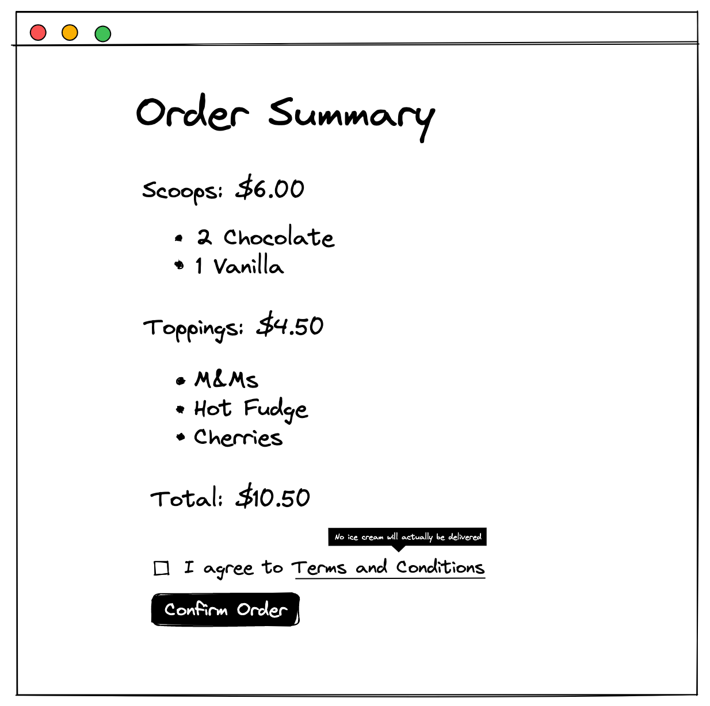

# Sundaes on Demand

This repository is the result of a course I did on React Testing Library.

Udemy course: [Testing React with Jest and React Testing Library](https://www.udemy.com/share/1040ZS3@CFdCKI5ithkwOYGf-YeYUq3_40mXz7F_x2ZIQxDPcX5jhDmrSme2g_-FVCr7coeB/) by [Bonnie Schulkin](https://bonnie.dev/)

It's a small application that allows the user to order **Sundaes** (psst - no deliveries will actually be made).

## Technologies

- React
- create-react-app
- testing-library/react
- testing-library/jest-dom
- testing-library/user-even
- Jest
- [Mock Service Worker](https://mswjs.io/)
- React Bootstrap
- axios
- eslint
- prettier

`testing-library/react` exposes objects like `render`, `screen`, `waitFor` and `logRoles`.

`render` allow the developer to render a React component in the DOM, just as a user would see in the browser. It renturns the `container` for the render which can be used with `logRoles` to get all the ARIA roles that are present. It also returns the `unmount` function for our component.

The `screen` object exposes 3 types of methods, `get`, `find` and `query`. We use `get` when expecting something to be in the DOM straight away, this method will throw and error if the element that we were trying to get is not present. `find` is used for finding elements that arrive asynchronously and it's an `async` function so we will need to `await` the result. Finally, `query` is used when we do not expect the element to be in the DOM therefore this function will not throw and error when the requested element is not present.

`waitFor` is usually used with multiple `find` operations as it awaits for all the async elements to arrive.

`testing-library/jest-dom` appends a few additional assertion methods to the `expect` object. For example `.toBeEnable`, `.toBeInTheDocument`, `.toHaveTextContent`, `.toHaveStyle` etc.

Even though the `resting-library/react` exposes an object called `fireEvent` we want to avoid using that, because that fires low level events and when the user is dispatching events in the browser by using it they can dispatch multiple events with on action. So using `testing-library/user-event` to simulate user events is recommended. Just as describe [here](https://ph-fritsche.github.io/blog/post/why-userevent).

## TDD

The development of this project used the TDD approach. Rarely looked at the application running in the browser, and it was actually quite refreshing not to click away in the browser, but to use the red, green, refactor approach.

## Architecture

We are using the traditional Client/Server architecture. The Server exposes an API using ExpressJS that has two GET endpoints for the _flavours_ and _toppings_, both return a list of names and image paths. And a POST endpoint for _order_ that returns the order number to the client. It is important to know the Schema that we are working with because the Mock Service Worker will need to use it in to be able to simulate the mock responses.

## Business Logic

The application has 3 high level states that guide the user through creating, reviewing and ordering their ice cream.

To implement this state machine across all the React components and to create an application level state we used a React Context as it's defined in this article: [Application State Management with React](https://kentcdodds.com/blog/application-state-management-with-react)

### Order Entry Page

While the application is `inProgress` the user has the ability to choose from scoops and toppings that came from the server as HTTP responses. We use Mock Service Worker in order to mock these requests. This allows us developers to test the application in a way that a real user would.

Implemented validation for the scoops, at least one scoops is mandatory and it has an upper and a lower limit.

`review`: Before the user confirms the order they look through the summary and agree to the Terms and Conditions.

`completed`: Finally, a server will respond with an order number for all orders.

## Static Code Analysis

We configured ESLint and Prettier to make our code clean and nicely formatted.
